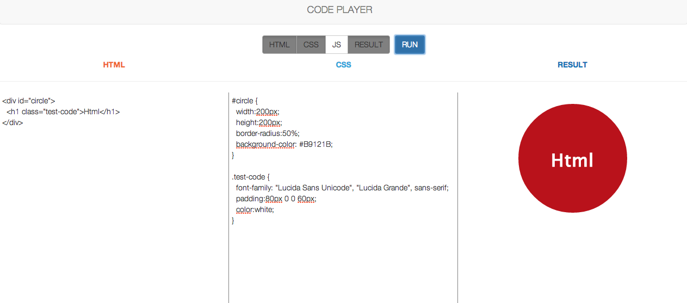

## Code player

#### jQuery Practice

http://jameslieu.co.uk/projects/jquery-code-player/index.html

Created a code player using jquery inspired by jsfiddle.net. Can run both html and css.

I've taken out the JS section because of security issues.
The line of code below left here for for reference:
```
document.getElementById('resultFrame').contentWindow.eval($("#jsCode").val())
```

<center>

</center>
